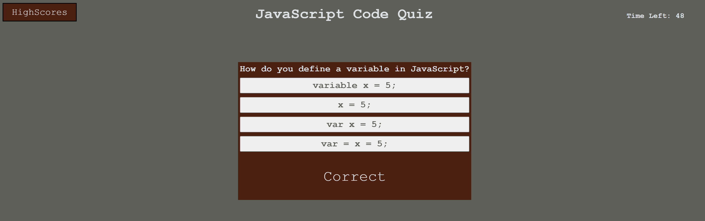
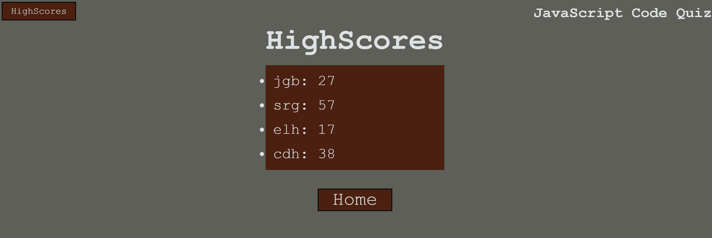

# Javascript Code Quiz

## Table of Contents
  - [Description](#description)
  - [Usage](#usage)
  - [Visuals](#visuals)
  - [Credits](#credits)

## Description
[Link to deployed site](https://christian-hoffman.github.io/javascript-code-quiz/)\
The Javascript Code Quiz is a timed quiz that tests your Javascript knowledge.\
It has 4 questions and a highscore board so you can really test yourself.

## Usage
Once on the page, clicking start will bring up the first question and start the countdown timer.\
The timer is 60 seconds and you will lose 10 seconds every time you get a question wrong.\
Your score will be your time remaining.\
Once you answer all questions or the timer reaches 0 you will be able to enter your initials for the highscore board.\

## Visuals

## Credits
Christian Hoffman